20487D_MOD01_LAK

\# Module 1: Overview of Service and Cloud Technologies

\# Lab: Exploring the Work Environment

**Exercise 1: Creating an ASP.NET Core Project**

**Task 1: Create a new ASP.NET Core project**

 

 

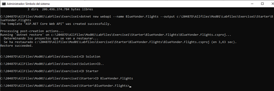

### Exercise 2: Creating a Simple Entity Framework Model

#### Task 1: Create a new POCO entity

 

 

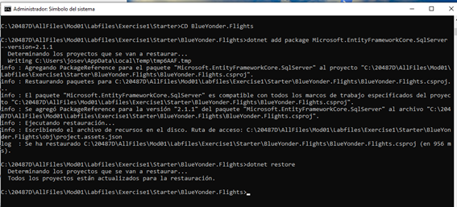

 

 

 

 

 

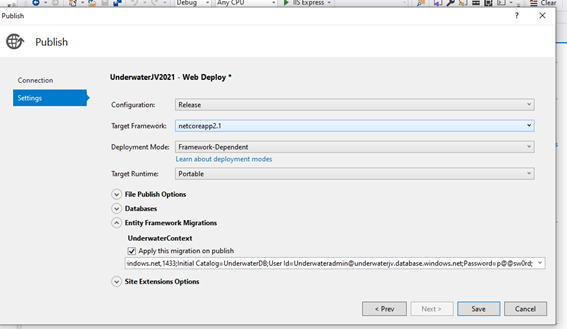

 

 

### Exercise 4: Deploying the Web Application to Azure

#### Task 1: Create an Azure Web App and an SQL database

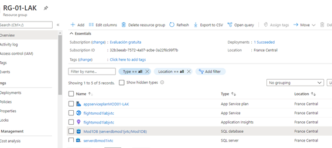

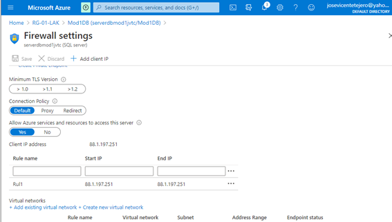

 

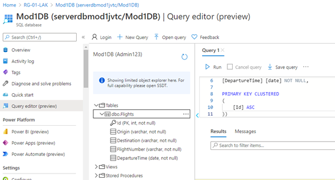

 

Task 2: Deploy the web application to the Azure Web App

 

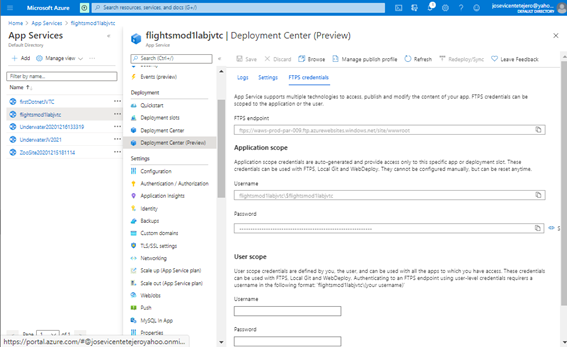

 

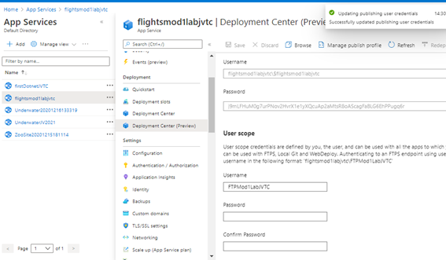

 

Al ejecutar:

$postParams = "{'origin': 'Germany',

  'destination': 'France',

  'flightNumber': 'GF7625',

  'departureTime': '0001-01-01T00:00:00'}"

Invoke-WebRequest -Uri http://flightsmod1labjvtc.azurewebsites.net/api/flights -ContentType "application/json" -Method POST -Body $postParams

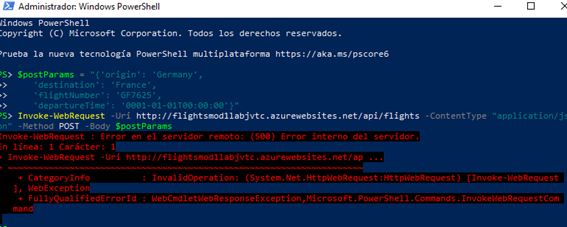

 

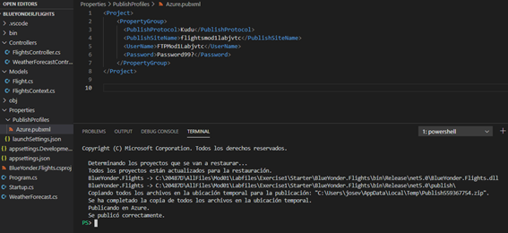

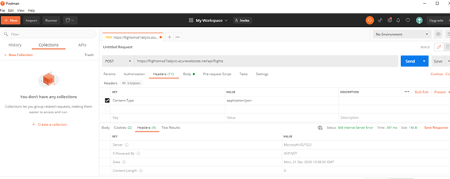

Como el comando Invoque no funciona, añadimos los registros directamente en la base de datos.

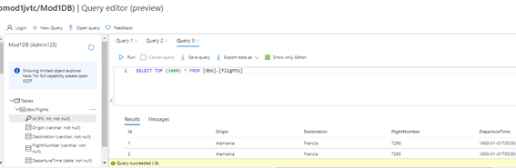

Comprobamos que funciona correctamente.

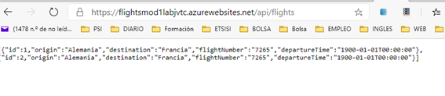

 

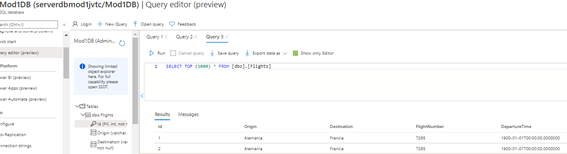

 